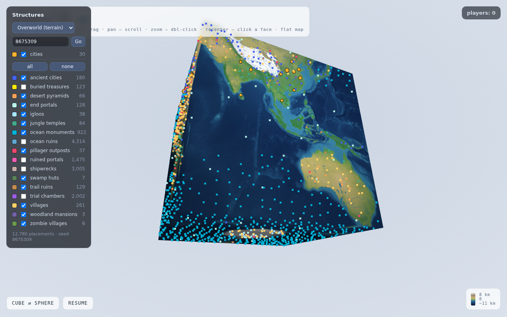
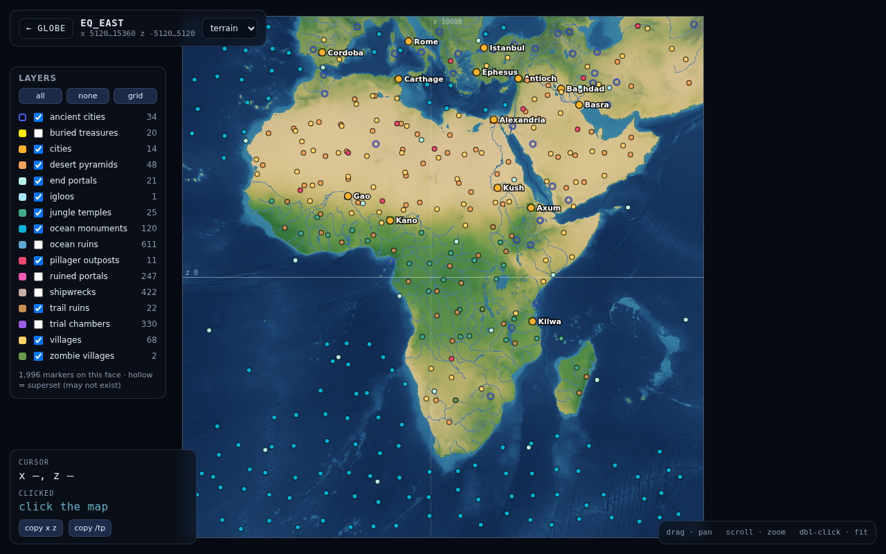
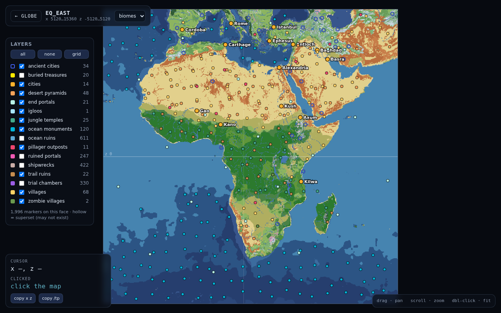

# CubeWorld

A Paper plugin that makes a Minecraft world behave like the surface of a planet: walk west across the international date line and you arrive in the far east of the map; walk over a pole and you come down the other side. No more invisible walls or endless procedurally-generated frontier — one finite, seamless, wrap-around world. And the planet is ours: the map is generated from real Earth data at roughly one kilometre per block.

## How it works

A sphere can't be tiled with square blocks, but a cube can — and a cube is topologically a sphere. CubeWorld structures the map as the six faces of a cube laid out in a single Minecraft world. Each face is a square region of normal terrain; the faces are logically stitched together along their twelve shared edges.

Crossing an edge is handled with two cooperating mechanisms, both entirely server-side:

- **Teleportation** — when a player walks across the boundary of one face, the server teleports them to the corresponding position on the adjacent face, rotating their orientation and velocity to match how the two faces meet on the cube. Done at the right moment, the transition is imperceptible.
- **Virtual blocks** — teleportation alone would still let you *see* the edge of the world. To make the seam invisible, the server sends packet-level "virtual" copies of the terrain from the adjacent face into the visible margin beyond each edge, transformed to line up with the local face's coordinates. The blocks the client renders past a boundary are a live view of the neighboring face; they exist only on the wire, never in the world save.

Because everything is done with standard teleports and block packets, **a stock vanilla client works unmodified** — no client mod, no resource pack. That constraint runs through every feature below.

## Features

### The seams

- **Seam teleportation** — players and all other entities crossing a stitched edge teleport with rotated position, view, and velocity. Walking east around the equator or south over a pole loops seamlessly.
- **Mirrored margins** — 96 blocks of terrain beyond every stitched edge render as a live view of the far side. Edits near a seam propagate into the mirrors, and edits *in* a mirror forward to the real blocks, with block states rotated appropriately.
- **Entity mirrors** — entities near a seam get synced clone puppets in the margin, so a creeper stalking you across the date line is visible before it crosses; damage to a clone forwards to its source.
- **Liquid continuity** — water and lava flow and drain across seams like anywhere else.
- **Portal linking** — nether portals preserve the cube-surface position, so a portal links to "the same place" in the other world rather than vanilla's coordinate scatter.
- **Corner pillars** — full-height bedrock cylinders at the eight cube vertices, the one place where consistent rendering is geometrically impossible.
- **Cube-aware locator bar** — the dots for other players point along the cube geodesic, not through the flat map.

### The planet

- **Real Earth terrain** — elevation and coastlines from Earth rasters folded onto the cube (~1 km/block), with vanilla's terrain router shaped by the real heightfield: continents, oceans, beaches, highlands, snowcaps, aquifers and caves underneath.
- **Real Earth biomes** — a climate-driven biome function places deserts, jungles, taigas and the rest where Earth actually has them.
- **1:8 cube nether** — the nether is its own cube at one-eighth scale: a true 8×-travel nether with vanilla nether terrain, biomes, lava seas and fortresses, seamless across its own edges.
- **Strongholds on the sphere** — the stronghold ring is placed in cube-aware positions so End portals are reachable from anywhere on the planet.
- **Spawn in the Rift Valley** — new players start at Addis Ababa, Ethiopia; humanity walks out of Africa again.

### Civilization

- **30 historical cities** — from Rome and Baghdad to Teotihuacan and Kilwa, vanilla villages generate at historically attested locations, sized by importance (large and huge tiers). Each city is its own structure registry entry, registered in code at boot — `/locate structure cubeworld:antioch` works, no datapack involved.
- **Forest villages** — vanilla ships no village for temperate forests, which would leave Europe and eastern North America empty; CubeWorld widens plains villages into the deciduous biomes so the natural settlement map matches history too.
- **The teleport network** — every city hosts a teleport station (a reskinned-lodestone pad, built as its chunk first loads). Stations form two rings spanning all 30 cities; craft a teleporter, stand on a pad, and travel costs lapis scaled by distance.
- **Master Traders** — rare traders with exceptional goods visit the special cities.

### Riches and exploration

- **Earth mineral provinces** — ore generation is enriched where the terrain corresponds to real mineral belts, layered on top of vanilla's own placement.
- **The Prospector** — a tuned brush whose enchantment glint blinks faster the closer you are to a province of its ore: a working ore detector rendered entirely with vanilla client affordances.
- **Exploration advancements** — custom achievements for reaching the poles, summiting the great peaks, and circumnavigating the planet.

### Tooling

- **Live web map** (`tools/playermap`) — a spinning-globe and per-face flat view of the planet with live players, biomes, structures, the city network, and End portals; click for coordinates.
- **Offline world tools** — region-file renderers and probes (`tools/voxcam.py` and friends) for inspecting terrain without a client.

The globe view renders the world as the cube it actually is (toggleable to a
sphere), with every structure layer togglable and counted:



Each face opens as a flat map — terrain or biome background, structure and
city layers, and click-to-coordinates (with a copyable `/tp`):





## Geometry notes

- Each cube edge joins two faces with a specific rotation (0°, 90°, 180°, or 270°); positions, look angles, and velocities are remapped accordingly on crossing.
- The eight cube corners are the degenerate points (analogous to the poles of a map projection): three faces meet, and the wrap-around margin there needs special handling.
- "Wraps at the international date line and poles" falls out naturally: travel in any fixed direction eventually returns you to your starting point, just as on a globe.

## Seeds and randomness on a folded cube

Chunk-seeded randomness (vanilla's model) can never agree across a stitched
seam — the two sides are unrelated chunks. Randomness here therefore comes in
three sanctioned forms:

1. **Seeded global fields** — the world seed selects phase offsets
   (`WorldSeeds`, SplitMix64-derived) for the noise fields that shape terrain
   height, caves, and cave biomes. Each seed picks a *different continuous
   function of the cube surface*, so every seed's world is seam-consistent by
   construction. Same seed, same planet.
2. **Position-keyed hashes** — per-feature placement hashes
   `(seed, source-resolved cell)`; margins then mirror features automatically.
3. **Chunk-seeded vanilla randomness** — used only for vanilla decorations
   (trees, ores, cave flora), which run exclusively on face chunks away from
   seams and pillars.

The Earth map ignores the seed for shape — data is data — and keeps it for
caves and decoration detail. The dev server pins `level-seed=8675309` for
reproducibility.

## Building and running

```sh
./gradlew build          # plugin jar in build/libs/
./gradlew runServer      # boot a dev Paper server with the plugin loaded
```

On memory-constrained dev boxes prefer `./run-server.sh` after building — it
launches Paper directly with a capped heap and no Gradle daemon. The dev
server lives in `run/`; accept the EULA in `run/eula.txt` on first launch.
Requires **Java 25 for both build and run** (the Gradle toolchain locates or
downloads one for the build).

Fresh-world bring-up is a single boot (city structures register in code),
then `python3 tools/seed_cities.py` to build the 30 teleport stations and
the web map's data; see `CLAUDE.md` for the operational detail.

## Commands

`/cubeworld` carries a large set of subcommands; the player-relevant ones:

| Command | Description |
| --- | --- |
| `/cubeworld face` | Which cube face you're on, with face-local coordinates. |
| `/cubeworld tp <face>` | Teleport to a face center (`north_pole`, `eq_prime`, `eq_east`, `eq_back`, `eq_west`, `south_pole`). |
| `/cubeworld tpstations` | The teleport network's station registry and ring status. |
| `/cubeworld map` | Where to reach the live web map. |
| `/locate structure cubeworld:<city>` | Find any of the 30 historical cities by name. |

The remainder (`biomeraster`, `strongholds`, `nudgeanchors`, `oreprobe`,
`villagepreview`, …) are development and diagnostic tools — see
`CubeWorldCommand` for the full list.

## License

[GPL-3.0](LICENSE)
